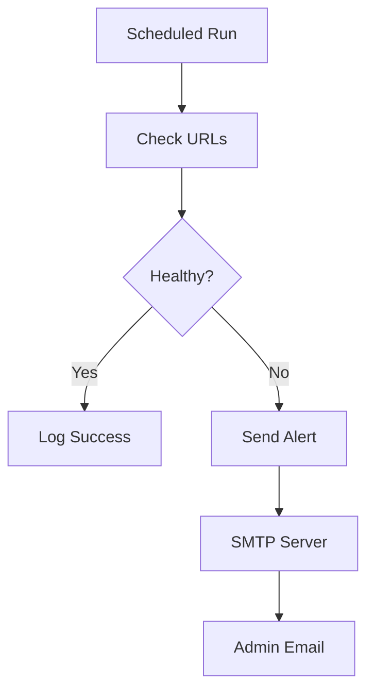

# URL Monitoring System


A production-ready website monitoring tool that checks URL availability, performance, and content integrity with email alerting capabilities.

## Features

✔ **Comprehensive Health Checks**  
- HTTP status code validation  
- Response time monitoring  
- Content verification (string matching)  

✔ **Instant Alerting**  
- Email notifications with detailed diagnostics  
- Multi-recipient support  
- Configurable alert thresholds  

✔ **Production Ready**  
- Proper logging (file + console)  
- Scheduled monitoring support  
- Connection pooling for efficiency  

## Quick Start

### Prerequisites
- Python 3.8+
- Gmail account (or other SMTP provider)

### Installation
```bash
git clone https://github.com/yourusername/url-monitor.git
cd url-monitor
pip install -r requirements.txt  # Only requests needed
```

### Configuration
Edit `config.py` with your settings:
```python
CONFIG = {
    "urls": [
        {
            "url": "https://example.com",
            "expected_status": 200,
            "search_string": "Expected Content"  # Optional
        }
    ],
    "smtp": {
        "server": "smtp.gmail.com",
        "port": 587,
        "username": "your_email@gmail.com",
        "password": "your_app_password",  # Generate at: https://myaccount.google.com/apppasswords
        "to": ["admin@yourcompany.com"]
    }
}
```

### Running
```bash
python monitor.py
```

### Scheduling (Linux)
Add to crontab for automated checks every 5 minutes:
```bash
*/5 * * * * /usr/bin/python3 /path/to/monitor.py >> /var/log/url_monitor.log 2>&1
```

## Architecture


## Customization Options

1. **Add Webhook Notifications**  
   Modify `send_alert()` to POST to Slack/Teams

2. **Enhance Checks**  
   Add DNS lookup time or SSL certificate validation

3. **Database Logging**  
   Integrate with SQLite/PostgreSQL for historical data

## Troubleshooting

**SMTP Connection Issues**  
- Verify app password is correct  
- Check firewall allows outbound port 587  
- Test SMTP settings with:  
  ```python
  import smtplib
  server = smtplib.SMTP("smtp.gmail.com", 587)
  server.starttls()
  server.login("you@gmail.com", "app_password")
  ```

**Pro Tip**: For large-scale monitoring, consider deploying as an AWS Lambda function with CloudWatch triggers!
